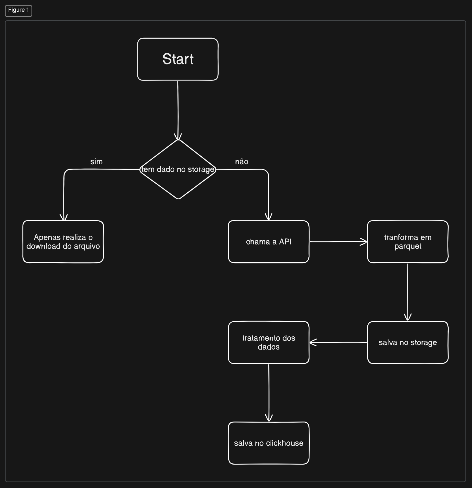

## Sistema AfonsinhoManga

Esse sistema atualmente está consumindo a API do mangadex, aonde possui alguns mangas registrados, com esse sistema é possivel pegar os mangas que eles disponibilizam e em seguida pode realizar a busca por eles para saber o ano os status e o nome do anime, isso tudo em ms :(

<br>

**So para deixar claro que não foi um erro subir o .env, esse projeto não vai para produção é apenas um treino XD**

<br>

Para executar o sistema deve ser seguido os próximos passos, executar o docker compose possuindo o clickhouse ( banco colunar ) e o Minio ( storage ), esse comando deve ser executado na root do projeto

```bash
docker compose up --build
```

Em seguida deve ser executado o seguinte comando para iniciar a aplicação:


```bash
poetry install
poetry run python app.py
```
 
Ele vai verificar automaticamente se ja tem os dados do manga no minio, caso não tenha ele vai executar a api externa para puxar os dados e em seguida fazer o tratamento dos dados

Em seguida pode realizar uma requisição pelo postman para a seguinte rota com o body:

```
http://localhost:5000/data
body: {
    "name":"Convenient Semi-Friend"
}
```

caso a API não tenha mudado de valor pro dia para a noite XD, deve retornar para o usuários essa seguinte resposta:

```json
{
    "content_rating": "suggestive",
    "manga_name": "Convenient Semi-Friend",
    "status": "ongoing",
    "year": "2023"
}
```

Para executar os testes precisa ser executado o comando abaixo:
```bash
poetry run pytest
```

Logica que eu estou seguindo:

Por conta do tempo esse fluxo tem uma falha no sentido de não verificar se os dados do storage ja foram tratados ou não, pois tem a change dele ja ter as informações no storage porem não realizou o tratamento, algo que vou modificar no futuro, para aprendizado :)


